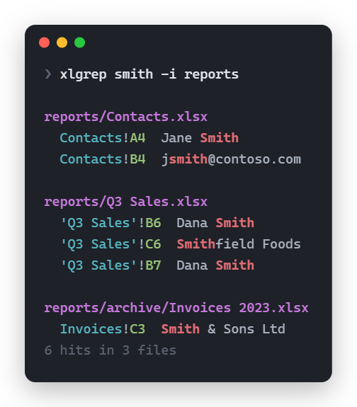

<div align="center">

<picture>
  <source media="(prefers-color-scheme: dark)" srcset="assets/xlgrep-logo-dark.svg">
  
</picture>

**[Usage] • [Key features] • [Installation] • [AI agents] • [Development]**

[Usage]: #usage
[Key features]: #key-features
[Installation]: #installation
[AI agents]: #using-with-ai-agents
[Development]: #development

*xlgrep* is grep for spreadsheets: search cell values and formulas<br>
across folders of `.xlsx`, `.xlsm`, `.xlsb`, `.xls` and `.ods` files. Read-only.



</div>

## Usage

```
xlgrep smith -i                  # current folder, recursive, case-insensitive
xlgrep "O'Brien" C:\dir -F       # literal text
xlgrep smith -w                  # whole word (-wF "C++" works too)
xlgrep smith -x                  # whole cell
xlgrep smith --row               # print each matching row in full
xlgrep smith --sheet Contacts    # only that sheet (others aren't even parsed)
xlgrep VLOOKUP --formulas -l     # workbooks whose formulas use VLOOKUP
xlgrep smith -c                  # hit count per file (rows with --row)
xlgrep smith -m 5                # stop each file after 5 hits
xlgrep smith --json --row        # JSON Lines for scripts and agents
xlgrep smith --json | head -50   # first 50 hits overall; the search stops early
```

Run `xlgrep --help` for the full option list.

## Key features

*Click to learn more.*

<details>
<summary>
<b>Every common spreadsheet format</b>
</summary>
<p></p>

`.xlsx`, `.xlsm`, `.xlsb`, `.xls` and `.ods`, read with [calamine](https://github.com/tafia/calamine).
No Excel or LibreOffice needed. Values print as Excel shows them where calamine allows: `TRUE`,
`2024-03-05`, `36:05:07` durations.
</details>

<details>
<summary>
<b>grep-style matching</b>
</summary>
<p></p>

Patterns are regexes; `-F` for literal text, `-i` to ignore case, `-w` for whole words (`-wF "C++"`
works too), `-x` to match the whole cell. `--sheet` limits the search to sheets with that name;
the others aren't even parsed. `--formulas` searches formula text (`=SUM(A1:A9)`) instead of values.
</details>

<details>
<summary>
<b>Results you can jump to</b>
</summary>
<p></p>

In a terminal, hits are grouped under each file with Excel-style refs like `'Q3 Sales'!B7`, which
paste straight into Excel's Name Box. Output is colored (`NO_COLOR` disables it) and cut to the
window width. `--row` prints each matching row in full instead of single cells.
</details>

<details>
<summary>
<b>Built for scripts and agents</b>
</summary>
<p></p>

AI agents can't read spreadsheets with their usual tools: `.xlsx` files are compressed, so
`grep`, `rg` and file readers find nothing inside them, and agents fall back to writing
openpyxl or pandas scripts. xlgrep is one command instead, with no Python environment.

`--json` prints JSON Lines: `{"file","sheet","cell","value"}` per hit, plus
`"row_values": {"A": …, "C": …}` keyed by column with `--row` (formula cells only with
`--formulas`). Only matching cells reach the agent's context, not whole sheets, and `-m`, `-l`,
`-c` and `| head` cap how much comes back; closing the pipe early stops the search. Every hit
names its sheet and cell, so a person can check it in Excel.

Exit code 0 if anything matched, 1 if not, 2 on an error: bad arguments, or anything that couldn't
be searched. Matches elsewhere still print and stderr names each skipped file and why, so an agent
can tell "not there" from "couldn't look". xlgrep is read-only and won't download OneDrive files
unless asked, so it's safe to let an agent run it without approval. See
[Using with AI agents](#using-with-ai-agents).
</details>

<details>
<summary>
<b>Fast</b>
</summary>
<p></p>

Files are read in parallel and output stays in file order: 400 files x 2000 rows take 0.25 s
instead of 1.56 s read one at a time. `--sheet` skips parsing other sheets entirely.
</details>

<details>
<summary>
<b>Safe on OneDrive</b>
</summary>
<p></p>

OneDrive online-only files are skipped by default, so a search never mass-downloads your OneDrive.
`--download` includes them. Skipped OneDrive files aren't errors.
</details>

<details>
<summary>
<b>Robust against bad files and bad cells</b>
</summary>
<p></p>

Unreadable files and folders (password-protected, corrupt, access denied, OneDrive offline) are
skipped with a reason, and the exit code says so. Control characters in cells print escaped
(`\n`, `\u{1b}`), so a cell can't break lines or inject terminal codes.
</details>

<details>
<summary>
<b>Non-features</b>
</summary>
<p></p>

xlgrep only reads. It doesn't replace or edit cells.<br>
Numbers print raw (`51200`, not `$51,200.00`); number formats aren't applied.<br>
The human-readable output is for reading. Anything that parses output should use `--json`.
</details>

## Installation

Windows, with [Scoop](https://scoop.sh):

```
scoop bucket add xlgrep https://github.com/DavisMcCracken/xlgrep
scoop install xlgrep
```

Or download the zip (Windows) or tar.gz (Linux x86_64/ARM, static, any distro) from
[Releases](https://github.com/DavisMcCracken/xlgrep/releases), unpack, and put `xlgrep` on your
PATH. Each release has a `SHA256SUMS` file to check the download.

Or build from source:

```
cargo install --git https://github.com/DavisMcCracken/xlgrep --locked
```

## Using with AI agents

Paste this into your agent instructions (`AGENTS.md`, `CLAUDE.md`, …):

```markdown
To search or read .xlsx/.xlsm/.xlsb/.xls/.ods files, use `xlgrep` instead of writing
openpyxl/pandas scripts. Use `--json` when parsing output: `{"file","sheet","cell","value"}`
per hit; add `--row` for the whole matching row. Keep output small: `-m 20` per file, `-l` for
matching files only, `-c` for counts, `| head -N` overall.
Examples: `xlgrep "smith" -i --json -m 20`, `xlgrep VLOOKUP --formulas -l`,
`xlgrep . book.xlsx --sheet Sheet1 --json | head -100` (dump a sheet's non-empty cells).
Numbers are raw (search `51200`, not `$51,200.00`). Exit 1 = no match; exit 2 = something
couldn't be searched: read stderr before concluding a value isn't there.
Don't pass `--download` (it downloads OneDrive online-only files) without asking.
```

## Development

[](https://github.com/DavisMcCracken/xlgrep/actions/workflows/ci.yml)

Build and run
```
cargo run --release -- <xlgrep args>
```

Run all tests
```
cargo test
```

On Windows without admin/Visual Studio, use the GNU toolchain: `scoop install rustup-gnu`.

### Releasing

Bump `version` in `Cargo.toml`, commit, then `git tag v0.2.0 && git push --tags`. The release
workflow checks the tag matches `Cargo.toml`, builds and tests, publishes the binaries with
`SHA256SUMS`, updates the Scoop manifest (`bucket/xlgrep.json`) and publishes to crates.io.
Running it by hand from the Actions tab builds and tests without publishing.

## License

MIT or Apache-2.0, at your option.
